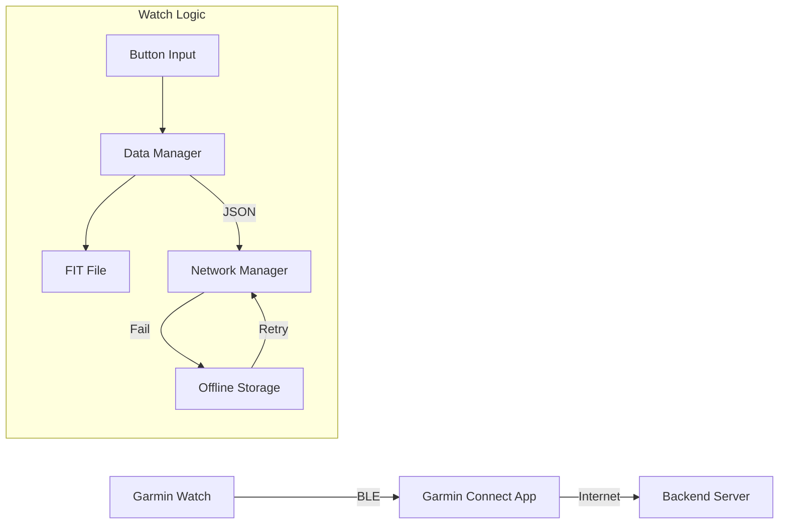

# 🌊 Ocean Campus

<div align="center">
  
<br/><br/>
  <table>
    <tr>
      <td width="50%">
        
      </td>
      <td width="50%">
        
      </td>
    </tr>
  </table>
</div>


**Garmin Descent™ Watch Application for Underwater Ecosystem Restoration**

수중 생태 복원 활동(성게 제거, 해조류 이식 등)을 위한 스마트 데이터 로깅 & 동기화 솔루션

---

## 📖 프로젝트 개요 (Overview)

이 프로젝트는는 다이버가 수중에서 물리 버튼만으로 생태 복원 활동 데이터를 기록하고, 이를 클라우드 서버로 전송하는 애플리케이션입니다. 터치스크린 사용이 불가능한 수중 환경과 불안정한 네트워크 환경을 고려하여 설계되었습니다.

### 핵심 기능

- **No-Login Pairing**: 복잡한 로그인 없이 6자리 고유 코드만으로 기기 인증 및 사용자 매핑
- **Offline-First Architecture**: 통신 실패 시 내부 저장소에 데이터를 큐(Queue)로 쌓아두고, 네트워크 연결 시 자동 재전송
- **Hybrid Logging**: 서버 전송용 정밀 데이터(JSON)와 가민 커넥트용 활동 로그(FIT) 동시 생성
- **Smart GPS**: 배터리 절약 및 대기 시간 단축을 위한 20초 타임아웃 로직 적용

---

## 🏗 시스템 아키텍처 (Architecture)



- **Client (Watch)**: 데이터 수집, 해싱(FNV-1a)을 통한 기기 ID 생성, FIT/JSON 패키징
- **Gateway (Mobile)**: 인터넷 연결을 위한 브리지 역할
- **Backend**: 활동 로그 수집 (`POST /api/v1/activities`) 및 분석

---

## 🛠 설치 및 설정 (Installation & Setup)

이 프로젝트는 **Connect IQ SDK 3.2.0 이상**이 필요합니다.

### 1. 필수 요구사항

- Visual Studio Code
- Garmin Monkey C Extension
- Garmin SDK Manager (Devices: Descent G1, Descent Mk2 등 다운로드)

### 2. 프로젝트 빌드

1. Repository를 Clone 합니다
2. VS Code에서 프로젝트를 엽니다
3. `manifest.xml`에서 타겟 디바이스(`iq:product`)가 올바르게 설정되었는지 확인합니다
4. **Run App** 또는 **Build for Device**를 실행합니다

### 3. API 설정 (Configuration)

`resources/strings/strings.xml` 파일에서 서버 엔드포인트와 API Key를 설정해야 합니다.

```xml
<strings>
    <string id="ApiUrl">https://your-server-url.com/api/v1/activities</string> 
    <string id="ApiKey">YOUR_SECURE_API_KEY</string>
</strings>
```

---

## 📜 사용자 매뉴얼 (User Guide)

### Phase 1: 준비 (Setup)

1. 앱 실행 후 **Start Diving** 선택
2. 활동 종류 선택 (Urchin Removal / Seaweed Transplant / Other)
3. 작업 구역(Grid) 지정 (예: A-1)
4. GPS 수신 대기 (최대 20초, 실패 시 기본 위치 사용)

### Phase 2: 작업 수행 (In-Water Operation)

모든 조작은 **물리 버튼**으로 이루어집니다.

| 버튼 | 성게 제거 (Urchin) | 해조류 이식 (Seaweed) | 기타 (Other) |
|------|-------------------|---------------------|-------------|
| **BACK** | 카운트 +1 (짧은 진동) | 다음 개체 기록 (짧은 진동) | 지점 기록 (긴 진동) |
| **MENU** | 수정 메뉴 (Edit Mode) | 수정 메뉴 (Edit Mode) | 수정 메뉴 (Edit Mode) |
| **UP/DOWN** | (없음) | 상태 변경 (New/Good/Poor) | (없음) |

### Phase 3: 종료 및 동기화 (Sync)

1. **End Diving** 선택 시 GPS로 출수 위치를 확보합니다
2. 자동으로 서버 업로드를 시도합니다
   - **성공**: "All Synced" 메시지 표시
   - **실패**: "Saved Locally" 메시지와 함께 큐에 저장 (다음 실행 시 자동 재시도)

---

## 📂 폴더 구조 (Project Structure)

```
OCDiver/
├── resources/                # 앱 리소스 (이미지, 레이아웃, 문자열)
│   ├── drawables/            # 아이콘 및 비트맵 리소스
│   ├── layouts/              # 화면 UI 레이아웃 (XML)
│   └── strings/              # 다국어 문자열 (strings.xml)
└── source/                   # 소스 코드
    ├── OCDiverApp.mc         # 앱 진입점 (Entry Point) & 생명주기 관리
    ├── OCDiverView.mc        # 메인 대시보드 화면 (수심, 카운트, 작업 상태 표시)
    ├── OCDiverDelegate.mc    # 메인 버튼 입력 처리 (기록, 메뉴 호출, 종료 등)
    ├── DeviceInfoView.mc     # 기기 페어링 코드 표시 화면
    ├── managers/             # 핵심 비즈니스 로직 (Business Logic)
    │   ├── DataManager.mc    # 데이터 집계, JSON 패키징, FIT 파일 제어
    │   ├── NetworkManager.mc # API 통신 및 오프라인 큐(Queue) 관리
    │   └── GpsManager.mc     # GPS 신호 수신, 타임아웃 및 위치 갱신
    └── pickers/              # 커스텀 입력 UI (Custom Pickers)
        ├── GridPicker.mc     # 작업 구역(예: A-1) 선택 UI
        └── IdPickerDelegate.mc # 개체 번호(ID) 설정 UI
```

---

## 📊 데이터 명세 (Data Specification)

서버로 전송되는 JSON Payload 예시입니다.

```json
{
  "summary": {
    "userId": "K9J2XM",         // Pairing Code (Hashed Device ID)
    "startTime": 1732675200,    // Session Start Timestamp
    "endTime": 1732678800,      // Session End Timestamp
    "startLat": 34.123456,      // 입수 위도
    "startLon": 127.123456,     // 입수 경도
    "endLat": 34.123900,        // 출수 위도
    "endLon": 127.123900
  },
  "activities": [
    {
      "activityType": "SEAWEED_TRANSPLANT",
      "gridId": "A-1",
      "totalCount": 2,
      "work_logs": [
        //Timestamp, Depth(m), Temp(C), UnitID, Status
        [1732675300, 5.2, 18.5, 100, "NEW"],
        [1732675450, 5.5, 18.4, 101, "GOOD"]
      ]
    },
    {
      "activityType": "URCHIN_REMOVAL",
      "gridId": "B-3",
      "totalCount": 15,
      "work_logs": [
        //Timestamp, Depth(m), Temp(C), CumulativeCount
        [1732676000, 6.1, 18.2, 1]
      ]
    },
    {
      "activityType": "OTHER_ACTIVITY",
      "gridId": "C-1",
      "totalCount": 1,
      "work_logs": [
        //Timestamp, Depth(m), Temp(C), PointCount
        [1732677200, 7.5, 17.9, 1]
      ]
    }
  ]
}
```

---

## 📱 지원 기기 (Supported Devices)
주의 : Garmin Descent 시리즈는 자체 LTE 통신 기능이 없습니다. 해상이나 야외에서 데이터를 서버로 전송하기 위해서는 스마트폰의 Garmin Connect 앱과 블루투스로 연결되어 있어야 합니다.
- Garmin Descent G1
- Garmin Descent G2
